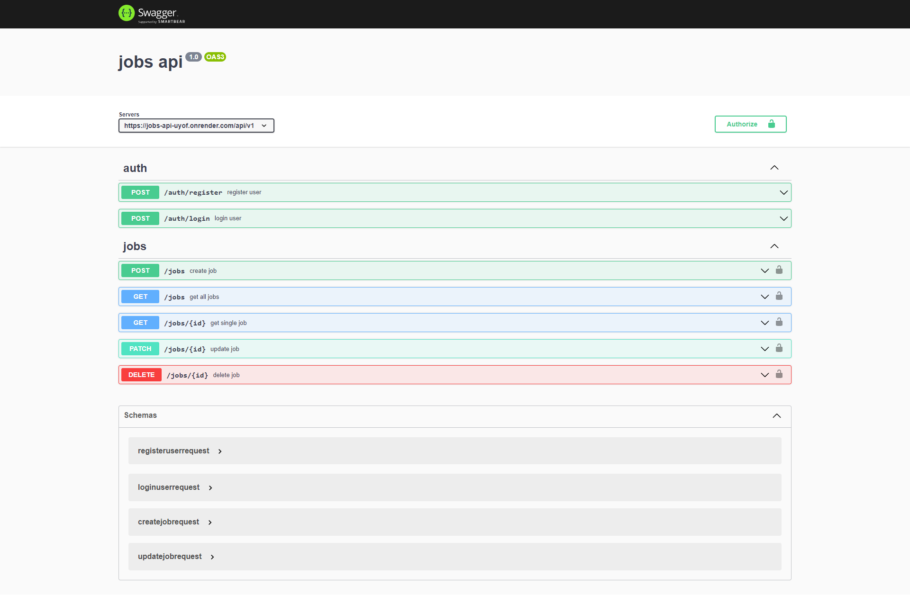

# Jobs API

## Built with

- bcryptjs
- cors
- Node
- express
- express-async-errors
- express-rate-limit
- helmet
- http-status-codes
- joi
- jsonwebtoken
- mongoose
- swagger-ui-express
- yamljs
- xss-clean

## Users should be able to:

- Users should be able to create an account by providing necessary details such as username, email, and password.
- Registered users should be able to log in securely using their credentials.
- Authenticated users should be able to create new job listings, specifying details such as job title, description, and requirements.
- Users should be able to see a list of all available job listings.
- Users should be able to view detailed information about a specific job.
- Job creators should be able to edit and update the details of a job they posted.
- Job creators should be able to remove a job listing they posted.
- The API documentation should be accessible through Swagger UI, providing users with clear information about the available endpoints, request parameters, and responses.
- User passwords are securely hashed before storing them in the database.
- User authentication ensures that only authorized users can perform certain actions like updating or deleting jobs.

## Links

- Live Site URL: [Jobs API](https://jobs-api-uyof.onrender.com/)
